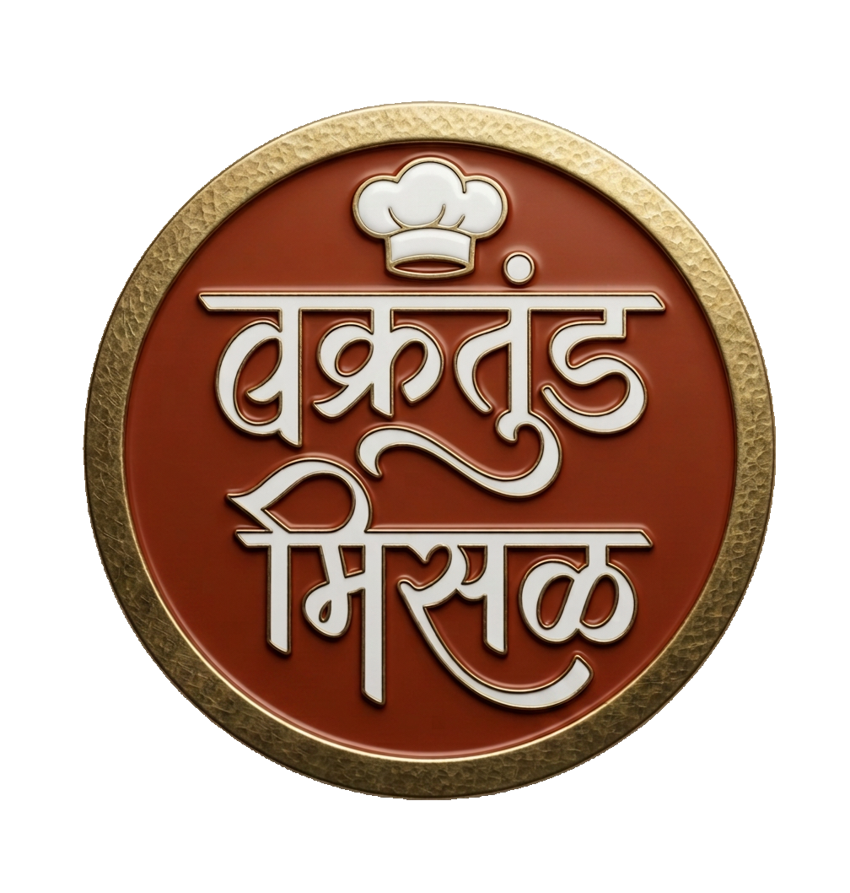

<div align="center">
  

  # Vakratunda Misal (वक्रतुंड मिसळ) 🪔

  **Authentic Maharashtrian Misal Experience in Alandi, Pune**

  [](https://reactjs.org/)
  [](https://www.typescriptlang.org/)
  [](https://tailwindcss.com/)
  [](https://vitejs.dev/)
</div>

<br/>

## 🌟 Overview

Vakratunda Misal is a modern, responsive restaurant landing and ordering application built to showcase the authentic taste of Maharashtrian Misal. Located near the sacred Alandi Temple in Pune, this digital experience brings the restaurant's rich heritage and fiery flavors directly to the customer's screen.

### ✨ Key Features
- **Immersive Landing Page**: Beautiful scroll animations and a warm, terracotta/saffron-themed UI using Framer Motion and Tailwind CSS.
- **Interactive Anatomy Viewer**: A visual breakdown of the perfect Misal plate.
- **Spice Meter System**: An engaging UI to help customers choose their perfect heat level.
- **Live Status Indicator**: Real-time open/closed status based on actual restaurant operating hours (7 AM - 10 PM IST).
- **WhatsApp Ordering**: A fully functional client-side cart system that formats orders and redirects to WhatsApp for seamless parcel delivery.
- **Mobile-First Design**: Optimized for mobile devices with a sticky quick-action bar for immediate calling and directions.

## 🛠️ Technology Stack

- **Frontend Framework**: [React.js](https://reactjs.org/)
- **Language**: [TypeScript](https://www.typescriptlang.org/)
- **Styling**: [Tailwind CSS](https://tailwindcss.com/)
- **Animations**: [Framer Motion](https://www.framer.com/motion/)
- **Routing**: [React Router v6](https://reactrouter.com/)
- **Icons**: [Lucide React](https://lucide.dev/)
- **Build Tool**: [Vite](https://vitejs.dev/)

## 🚀 Getting Started

### Prerequisites
Make sure you have Node.js (v18 or higher) installed on your system.

### Installation

1. Clone the repository
```bash
git clone https://github.com/pranav-6944/Vakratunda-Misal.git
cd Vakratunda-Misal
```

2. Install dependencies
```bash
npm install
```

3. Start the development server
```bash
npm run dev
```

4. Build for production
```bash
npm run build
```

## 📂 Project Structure

```text
src/
├── components/
│   ├── layout/       # Navbar, Footer, MobileStickyBar
│   ├── sections/     # Hero, MisalExplosion, MenuExperience, etc.
│   └── ui/           # Reusable UI elements (SpiceMeter, SteamEffect)
├── data/             # Static data (menu items, reviews, restaurant info)
├── pages/            # Page-level components (HomePage, MenuOrderPage)
├── utils/            # Helper functions (time tracking, status calculation)
├── App.tsx           # Main Router setup
└── index.css         # Tailwind directives and custom fonts
```

## 🎨 Design System
The application utilizes a custom-tailored design system reflecting Indian culinary heritage:
- **Terracotta**: Earthy tones representing traditional clay pots.
- **Saffron & Turmeric**: Vibrant accents representing Indian spices.
- **Parchment**: Warm, off-white backgrounds for a classic, clean look.
- **Typography**: Uses modern sans-serif paired with specialized Devanagari fonts for authentic Marathi text.

## 📱 Contact & Ordering
The ordering system currently leverages WhatsApp for immediate, zero-friction customer interaction. Orders are structured directly in the app and passed to the WhatsApp API.

<div align="center">
  <br/>
  <p>Made with ❤️ for Misal Lovers</p>
</div>
